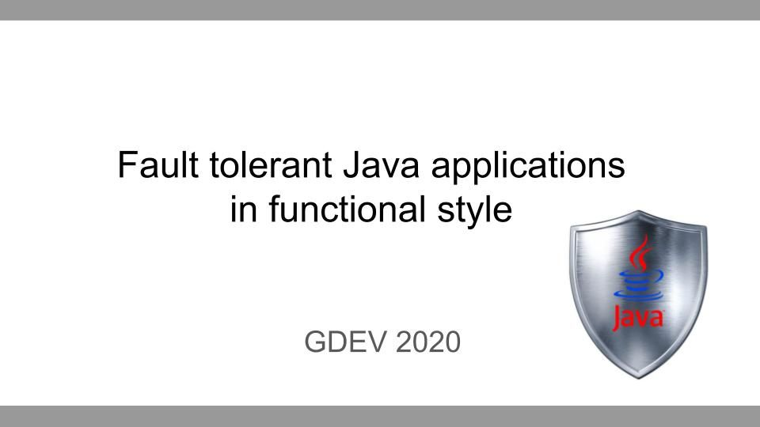

# resilience4j-demo

This repository contains the code examples for my talk _Building robust and fault tolerant Java applications in functional style_, that was presented at the GDEV2020 conference.

# Slides

The slide deck is also available online:

